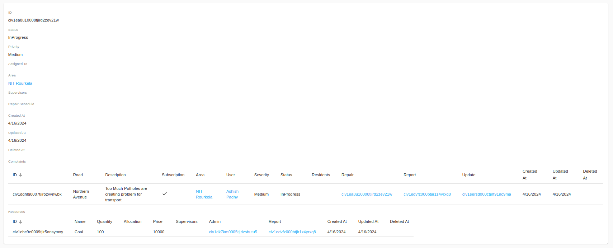

# Road Repair and Tracking System

The Road Repair and Tracking System is a web application that allows users to report road issues such as potholes, cracks, and other road damages. The system will then track the status of the reported road issues and provide updates to the users. This project is being undertaken as part of the Software Engineering course at NIT Rourkela by [Ashish Padhy](https://github.com/Shurtu-gal).

## Features

- User registration and login
- Role-based access control (Admin, User, Supervisor)
- Report road issues
- Track status of reported road issues
- Update status of road issues
- Generate reports and analytics
- Notifications and alerts
- User profile management
- Admin dashboard for managing users and issues ( Integrates everything by using roles and permissions )
- Secure authentication and authorization
 
## Demo

The backend is built using [NestJS](https://nestjs.com/) and the frontend is built using [React](https://reactjs.org/). The database used is [PostgreSQL](https://www.postgresql.org/). The application is deployed on [Render](https://render.com/) and [Netlify](https://www.netlify.com/).

You can access the demo of the application using the following links:

- [Road Repair and Tracking System](https://road-repair-tracking-system.netlify.app)
- [Admin Dashboard](https://road-repair-tracking-system.netlify.app/admin)
- [Backend API](https://road-repair-tracking-system.onrender.com/api) with **Swagger UI**.
- [GraphQL Playground](https://road-repair-tracking-system.onrender.com/graphql)

## Working and Screenshots

### **Admin Dashboard and analytics**

    

### **User Registration and Login**

    

### **List Users and Issues**

    

### **User Summary and Dashboard**

    

### **Edit User and Issue Details**

    

### **Create and Update Complaints**
    
    

### **Show and Update Complaints**

    

### **Precise Summary for Supervisor**

    

### **Sumamry for Admin**

    

### **Schedule Repairs and Update Status**

    

### **Generate Reports and Analytics**

    
    